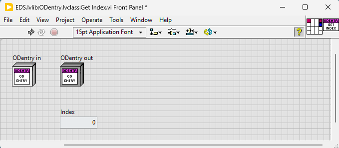
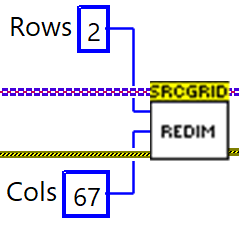

With this package installed, QuickDrop will create a smaller icon in the absence of error terminals on the connector pane. The original files will be restored when uninstalling this package.

Additionally the library text can resource full 32px of Icon width.

