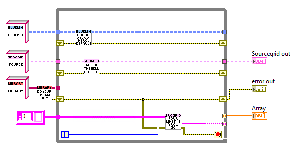

# QuickDrop Enhancements

Adjusts the automatic icon generation for libraries and VIs to accommodate maximized text carriage. Removes the border around the library banner to improve readability of 4-line VI icon text. The lines are allowed to hold 30 pixels of text instead of 28. For readability reasons, the black border color is changed to gray.

Impacts: Set Text Icon in a library's properties menu, Quick Drop's Auto format text (Ctrl+K).

---

## Install

find the .vip package in vipm folder.

---