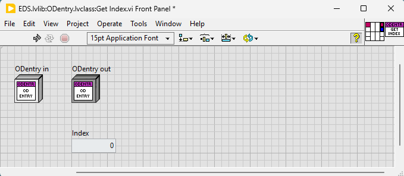
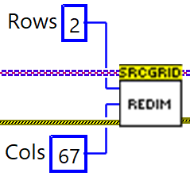

# QuickDrop Enhancements

With this package installed, QuickDrop ctrl-F will create a smaller icon in the absence of error terminals on the connector pane.

Additionally, the library text will fully utilize the 32px width of the icon for enhanced clarity

---

## Installation Instructions

1. **Backup Your Files**  
   Before proceeding, create a backup of your local directories by zipping the following paths:  
   - `C:\Program Files\National Instruments\LabVIEW 20xx\vi.lib\LabVIEW Icon API`  
   - `C:\Program Files\National Instruments\LabVIEW 20xx\resource\Framework\Providers\VILibrary`

2. **Copy Files**  
   Copy the contents of the `vi.lib` and `resource` directories from this repository into your LabVIEW-20xx folder.

---